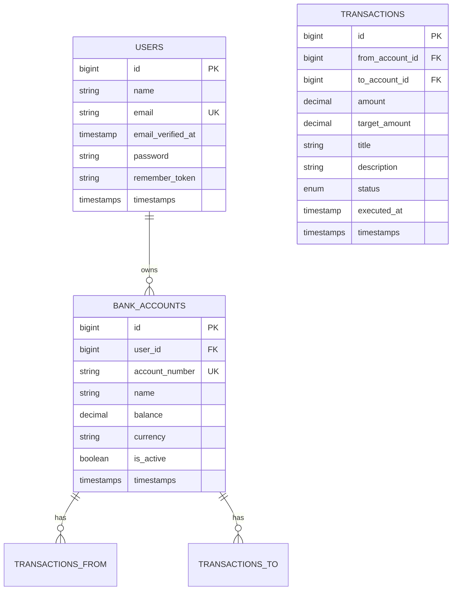

# Dokumentacja Techniczna Aplikacji Bankowej

## Spis treści
1. [Wprowadzenie](#wprowadzenie)
2. [Wymagania systemowe](#wymagania-systemowe)
3. [Instalacja i uruchomienie](#instalacja-i-uruchomienie)
    - [Uruchomienie w systemie Windows](#uruchomienie-w-systemie-windows)
    - [Uruchomienie w systemie macOS/Linux](#uruchomienie-w-systemie-macoslinux)
    - [Struktura kontenerów Docker](#struktura-kontenerów-docker)
4. [Architektura systemu](#architektura-systemu)
    - [Struktura projektu](#struktura-projektu)
    - [Technologie](#technologie)
    - [Model danych](#model-danych)
5. [API](#api)
    - [Endpointy API](#endpointy-api)
    - [Autoryzacja](#autoryzacja)
6. [Funkcjonalności systemu](#funkcjonalności-systemu)
    - [Moduł użytkowników](#moduł-użytkowników)
    - [Moduł kont bankowych](#moduł-kont-bankowych)
    - [Moduł transakcji](#moduł-transakcji)
    - [Moduł wymiany walut](#moduł-wymiany-walut)
7. [Zarządzanie bazą danych](#zarządzanie-bazą-danych)
    - [Migracje bazy danych](#migracje-bazy-danych)
    - [Rollback migracji w Dockerze](#rollback-migracji-w-dockerze)
    - [Zarządzanie przez phpMyAdmin](#zarządzanie-przez-phpmyadmin)
8. [Dane testowe](#dane-testowe)
9. [Rozwój aplikacji](#rozwój-aplikacji)
10. [Rozwiązywanie problemów](#rozwiązywanie-problemów)

## Wprowadzenie

Aplikacja Bankowa to nowoczesny system bankowości internetowej zbudowany przy użyciu technologii Laravel i React. System umożliwia zarządzanie kontami bankowymi, wykonywanie przelewów oraz śledzenie historii transakcji. Aplikacja obsługuje konta w różnych walutach i umożliwia przewalutowanie środków podczas przelewów.

Projekt został w pełni skonteneryzowany przy użyciu Dockera, co zapewnia spójne środowisko uruchomieniowe niezależne od platformy.

## Wymagania systemowe

Aby uruchomić aplikację, wymagane są następujące komponenty:

- Docker Engine (v20.10.0 lub nowszy)
- Docker Compose (v2.0.0 lub nowszy)
- Git

Opcjonalnie:
- PHP 8.2 (do pracy poza środowiskiem Docker)
- Composer
- Node.js 16+ i npm

## Instalacja i uruchomienie

### Uruchomienie w systemie Windows

1. Sklonuj repozytorium projektu:
   ```
   git clone https://github.com/Rafal-wq/banking-app.git
   cd aplikacja-bankowa
   ```

2. Uruchom skrypt startowy:
   ```
   ./start.cmd
   ```

3. Po ukończeniu procesu inicjalizacji, aplikacja będzie dostępna pod adresem:
   ```
   http://localhost:8000
   ```

### Uruchomienie w systemie macOS/Linux

1. Sklonuj repozytorium projektu:
   ```
   git clone https://github.com/Rafal-wq/banking-app.git
   cd aplikacja-bankowa
   ```

2. Nadaj uprawnienia wykonywania dla skryptów:
   ```
   chmod +x start.sh init.sh
   ```

3. Uruchom skrypt startowy:
   ```
   ./start.sh
   ```

4. Po ukończeniu procesu inicjalizacji, aplikacja będzie dostępna pod adresem:
   ```
   http://localhost:8000
   ```

### Struktura kontenerów Docker

Aplikacja składa się z następujących kontenerów:

1. **app** - Kontener PHP-FPM zawierający kod aplikacji Laravel
    - Bazuje na PHP 8.2
    - Zawiera wszystkie wymagane rozszerzenia PHP
    - Plik konfiguracyjny: `Dockerfile`

2. **nginx** - Serwer webowy przekazujący żądania do kontenera PHP
    - Bazuje na nginx:1.25-alpine
    - Konfiguracja: `nginx/default.conf`
    - Udostępnia aplikację na porcie 8000

3. **mysql** - Baza danych MySQL
    - Bazuje na mysql:8.0
    - Dane przechowywane w wolumenie Docker

4. **node** - Kontener Node.js do kompilacji zasobów frontendowych
    - Bazuje na node:20-alpine
    - Używany do instalacji zależności npm i kompilacji Reacta

5. **phpmyadmin** - Interfejs do zarządzania bazą danych MySQL
    - Dostępny pod adresem http://localhost:8080
    - Używany do wizualnego zarządzania bazą danych

6. **vite** (opcjonalnie, w trybie deweloperskim) - Serwer deweloperski Vite
    - Bazuje na node:20-alpine
    - Udostępnia HMR (Hot Module Replacement) dla frontendu

Struktura kontenerów jest definiowana w pliku `docker-compose.yml` z dodatkową konfiguracją rozwojową w `docker-compose.override.yml`.

## Architektura systemu

### Struktura projektu

Projekt jest oparty na architekturze MVC (Model-View-Controller) po stronie backendu oraz na komponentowym podejściu Reacta po stronie frontendu.

Główne katalogi projektu:

```
.
├── .do/                    # Konfiguracja dla Digital Ocean App Platform
├── app/                    # Kod źródłowy aplikacji Laravel
│   ├── Http/               # Kontrolery, middleware, żądania
│   ├── Models/             # Modele Eloquent
│   └── Services/           # Serwisy aplikacji (np. wymiana walut)
├── bootstrap/              # Pliki startowe Laravel
├── config/                 # Konfiguracja aplikacji
├── database/               # Migracje i seedery bazy danych
├── docker/                 # Konfiguracje Docker (jeśli wydzielone)
├── public/                 # Publiczny katalog dostępny przez web
├── resources/              # Zasoby frontendowe i widoki
│   ├── css/                # Style CSS/Tailwind
│   ├── js/                 # Kod JavaScript/React
│   └── views/              # Widoki Blade (głównie app.blade.php)
├── routes/                 # Definicje tras
│   ├── api.php             # Trasy API
│   └── web.php             # Trasy webowe
├── storage/                # Pliki przechowywane przez aplikację
├── tests/                  # Testy automatyczne
├── .env.example            # Przykładowy plik konfiguracyjny
├── .env.docker            # Plik konfiguracyjny dla Dockera
├── docker-compose.yml      # Definicja usług Docker
├── docker-compose.override.yml # Dodatkowa konfiguracja deweloperska
├── Dockerfile              # Instrukcje budowania obrazu PHP
├── init.sh                 # Skrypt inicjalizacyjny (Linux/macOS)
├── init.ps1                # Skrypt inicjalizacyjny (Windows)
└── start.sh/start.cmd      # Skrypty startowe
```

### Technologie

Aplikacja wykorzystuje następujące technologie:

#### Backend:
- **Laravel 12** - Framework PHP
- **MySQL 8.0** - System zarządzania bazą danych
- **Laravel Sanctum** - Uwierzytelnianie API
- **Inertia.js** - Zapewnia integrację między Laravel i React

#### Frontend:
- **React** - Biblioteka JavaScript do budowy interfejsu użytkownika
- **Tailwind CSS** - Framework CSS
- **Headless UI** - Dostępne komponenty UI
- **Vite** - Narzędzie budujące frontend

#### Infrastruktura:
- **Docker** - Konteneryzacja aplikacji
- **Nginx** - Serwer HTTP
- **Docker Compose** - Orkiestracja kontenerów

### Model danych

Model danych aplikacji składa się z trzech głównych encji:



#### Opis relacji:

1. **User (Użytkownik)** - podstawowa encja reprezentująca użytkownika systemu
    - Może posiadać wiele kont bankowych (relacja jeden-do-wielu)

2. **BankAccount (Konto bankowe)** - reprezentuje konto bankowe użytkownika
    - Należy do jednego użytkownika (relacja wiele-do-jednego)
    - Może być źródłem lub celem wielu transakcji (relacja jeden-do-wielu)
    - Zawiera informacje o saldzie i walucie konta

3. **Transaction (Transakcja)** - reprezentuje operację finansową między kontami
    - Połączona z dwoma kontami: źródłowym i docelowym (relacje wiele-do-jednego)
    - Przechowuje informacje o kwocie, tytule, statusie i czasie wykonania
    - Może zawierać dodatkowe informacje o przewalutowaniu (target_amount)

## API

### Endpointy API

Aplikacja udostępnia następujące główne endpointy API:

#### Autoryzacja:
- `POST /api/login` - Logowanie użytkownika
- `POST /api/register` - Rejestracja nowego użytkownika
- `POST /api/logout` - Wylogowanie użytkownika

#### Konta bankowe:
- `GET /api/bank-accounts` - Lista kont bankowych użytkownika
- `POST /api/bank-accounts` - Utworzenie nowego konta bankowego
- `GET /api/bank-accounts/{id}` - Szczegóły konta bankowego
- `PATCH /api/bank-accounts/{id}` - Aktualizacja konta bankowego
- `DELETE /api/bank-accounts/{id}` - Usunięcie konta bankowego
- `POST /api/bank-accounts/{id}/deposit` - Wpłata na konto
- `POST /api/bank-accounts/{id}/withdraw` - Wypłata z konta

#### Transakcje:
- `GET /api/transactions` - Lista transakcji użytkownika
- `POST /api/transactions` - Utworzenie nowej transakcji
- `GET /api/transactions/{id}` - Szczegóły transakcji
- `GET /api/bank-accounts/{id}/transactions` - Historia transakcji dla konta
- `GET /api/find-account` - Wyszukiwanie konta po numerze (dla przelewów zewnętrznych)

#### Wymiana walut:
- `GET /api/exchange-rates` - Pobranie aktualnych kursów walut

### Autoryzacja

Aplikacja używa Laravel Sanctum do autoryzacji API. Dostęp do chronionych zasobów wymaga tokena uwierzytelniającego.

Proces autoryzacji:
1. Użytkownik loguje się poprzez endpoint `/api/login`
2. Po udanym logowaniu otrzymuje token dostępowy
3. Token należy dołączać do wszystkich żądań API w nagłówku `Authorization: Bearer {token}`

## Funkcjonalności systemu

### Moduł użytkowników

Moduł użytkowników umożliwia:
- Rejestrację nowego użytkownika
- Logowanie do systemu
- Zarządzanie profilem użytkownika
- Zmianę hasła użytkownika

Konto użytkownika jest niezbędne do korzystania z pozostałych funkcjonalności aplikacji.

### Moduł kont bankowych

Moduł kont bankowych pozwala na:
- Tworzenie nowych kont bankowych w różnych walutach (PLN, EUR, USD, GBP)
- Wpłaty i wypłaty środków
- Przeglądanie salda i szczegółów konta
- Dezaktywację konta

Każdy użytkownik może posiadać wiele kont w różnych walutach.

### Moduł transakcji

Moduł transakcji umożliwia:
- Wykonywanie przelewów między własnymi kontami
- Wykonywanie przelewów na konta innych użytkowników
- Automatyczne przewalutowanie przy przelewach między kontami w różnych walutach
- Przeglądanie historii transakcji

System obsługuje statusy transakcji: oczekująca, zakończona, anulowana.

### Moduł wymiany walut

Moduł wymiany walut pozwala na:
- Sprawdzenie aktualnych kursów walut
- Przewalutowanie środków między kontami w różnych walutach
- Przeliczenie równowartości kwoty w innej walucie

## Zarządzanie bazą danych

### Migracje bazy danych

Aplikacja korzysta z systemu migracji Laravel do zarządzania strukturą bazy danych.

#### Wykonywanie migracji
Po wprowadzeniu zmian w strukturze bazy danych:

```bash
# W środowisku Docker
docker-compose exec app php artisan migrate

# Lub bezpośrednio
php artisan migrate
```

#### Migracje z danymi testowymi
Aby zresetować bazę danych i wypełnić ją danymi testowymi:

```bash
# Przebudowanie bazy danych i uruchomienie seederów
docker-compose exec app php artisan migrate:fresh --seed
```

### Rollback migracji w Dockerze

Projekt obsługuje pełny rollback migracji bazy danych w środowisku Docker. Rollback pozwala na cofnięcie zmian wprowadzonych przez migracje, co jest szczególnie przydatne podczas rozwoju aplikacji i testowania.

#### Dostępne komendy rollbacku:

```bash
# Cofnięcie ostatniej migracji
docker-compose exec app php artisan migrate:rollback

# Cofnięcie określonej liczby migracji
docker-compose exec app php artisan migrate:rollback --step=3

# Cofnięcie wszystkich migracji
docker-compose exec app php artisan migrate:reset

# Cofnięcie wszystkich migracji i ponowne ich wykonanie
docker-compose exec app php artisan migrate:refresh

# Usunięcie wszystkich tabel i ponowne wykonanie migracji
docker-compose exec app php artisan migrate:fresh
```

#### Ważne uwagi dotyczące rollbacku:
- Operacje rollbacku są destrukcyjne - usuwają dane z tabel
- W środowisku produkcyjnym należy używać ich z rozwagą
- Operacja `migrate:fresh` całkowicie usuwa wszystkie tabele i tworzy je od nowa
- Aby zachować dane testowe po rollbacku, używaj komendy `migrate:refresh --seed`

#### Przykłady zastosowania:

```bash
# Scenariusz: Cofnięcie ostatniej dodanej migracji
docker-compose exec app php artisan migrate:rollback

# Scenariusz: Pełne odtworzenie bazy danych z danymi testowymi
docker-compose exec app php artisan migrate:fresh --seed

# Scenariusz: Cofnięcie 3 ostatnich migracji i ponowne ich wykonanie
docker-compose exec app php artisan migrate:rollback --step=3
docker-compose exec app php artisan migrate
```

Te komendy działają w kontekście kontenerów Docker, dzięki czemu nie ma potrzeby instalowania Laravel i jego zależności lokalnie na maszynie hosta.

### Zarządzanie przez phpMyAdmin

W środowisku deweloperskim dostępny jest phpMyAdmin do wizualnego zarządzania bazą danych:

- Adres: http://localhost:8080
- Dane logowania:
    - Serwer: mysql
    - Użytkownik: laravel
    - Hasło: secret

Te dane są używane tylko w środowisku deweloperskim i nie są używane w produkcji.

phpMyAdmin umożliwia:
- Przeglądanie struktury bazy danych
- Wykonywanie zapytań SQL
- Modyfikację danych w tabelach
- Eksportowanie i importowanie danych
- Wizualizację relacji między tabelami

#### Eksport schematu bazy danych

Aby wyeksportować schemat bazy danych z phpMyAdmin:

1. Zaloguj się do phpMyAdmin pod adresem http://localhost:8080
2. Z listy baz danych wybierz bazę danych projektu (domyślnie `laravel`)
3. Kliknij zakładkę "Eksportuj" w górnym menu
4. Wybierz opcję "Szybki" lub "Niestandardowy" (dla większej kontroli)
5. Dla wizualizacji struktury bazy danych, możesz również użyć funkcji "Projektant" (zakładka "Więcej")
6. Pobierz wygenerowany schemat lub zrzut ekranu i umieść go w katalogu `resources/docs` projektu

## Dane testowe

Aplikacja zawiera predefiniowane dane testowe dostępne po uruchomieniu seedera:

```bash
# W środowisku Docker
docker-compose exec app php artisan db:seed

# Lub bezpośrednio
php artisan db:seed
```

Dostępne konta testowe:

1. **Admin User**
    - Email: `admin@example.com`
    - Hasło: `password`

2. **Test User**
    - Email: `test@example.com`
    - Hasło: `password`

Seeder utworzy również przykładowe konta bankowe i transakcje, które pozwalają na przetestowanie wszystkich funkcjonalności systemu.

## Rozwój aplikacji

### Uruchomienie w trybie deweloperskim

Aby włączyć automatyczne przeładowywanie zasobów frontendowych:

```bash
# W środowisku Docker
docker-compose up -d vite

# Lub bezpośrednio
npm run dev
```

### Wykonywanie migracji

Po wprowadzeniu zmian w strukturze bazy danych:

```bash
# W środowisku Docker
docker-compose exec app php artisan migrate

# Lub bezpośrednio
php artisan migrate
```

### Uruchamianie testów

```bash
# W środowisku Docker
docker-compose exec app php artisan test

# Lub bezpośrednio
php artisan test
```

## Rozwiązywanie problemów

### Problem z dostępem do bazy danych

Jeśli aplikacja nie może połączyć się z bazą danych:

1. Sprawdź status kontenera MySQL:
   ```
   docker-compose ps mysql
   ```

2. Sprawdź logi kontenera MySQL:
   ```
   docker-compose logs mysql
   ```

3. Sprawdź, czy wolumen danych MySQL został poprawnie utworzony:
   ```
   docker volume ls | grep mysql-data
   ```

### Problem z kompilacją zasobów frontendowych

Jeśli frontend nie ładuje się poprawnie:

1. Sprawdź logi kontenera node:
   ```
   docker-compose logs node
   ```

2. W razie potrzeby ręcznie uruchom kompilację:
   ```
   docker-compose run node run build
   ```

### Problem z uprawnieniami do plików

Jeśli wystąpią problemy z uprawnieniami do plików:

1. Wykonaj skrypt naprawiający uprawnienia:
   ```
   docker-compose exec app chown -R laravel:www-data storage bootstrap/cache
   docker-compose exec app chmod -R 775 storage bootstrap/cache
   ```

### Resetowanie aplikacji

Aby całkowicie zresetować aplikację i jej dane:

1. Zatrzymaj wszystkie kontenery:
   ```
   docker-compose down
   ```

2. Usuń wolumen bazy danych:
   ```
   docker volume rm aplikacja-bankowa_mysql-data
   ```

3. Uruchom aplikację ponownie:
   ```
   ./start.sh # lub ./start.cmd na Windows
   ```
